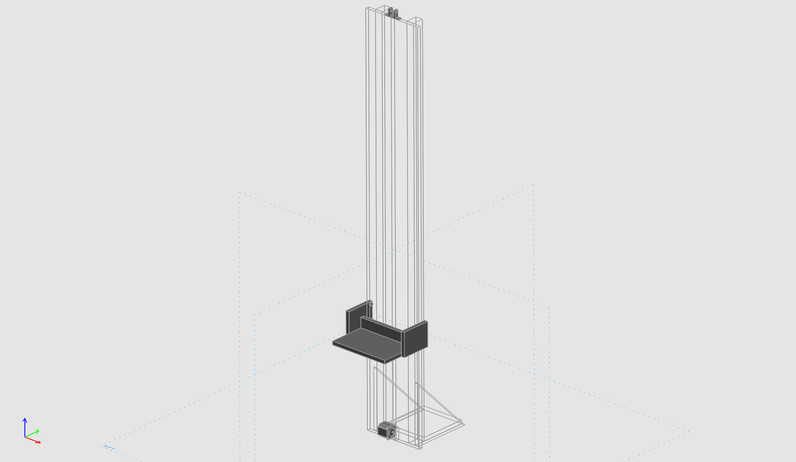

# Elevator

Controller for a linear positioner.

## Description
This project provides a python interface to lift a platform attached on a belt which is driven by a motor, interfaced by [StepperDrive](https://github.com/EMS-TU-Ilmenau/StepperDrive).



## How to install
Clone this repository somewhere to the host computer that will control your devices.
In the newly created directory, install the package with: `pip install .`

Now, you can import **elevator** from anywhere on that computer in python.

## Usage
Connect the motor controller board via an ethernet cable to the hub (can be a single slot hub).
On the hub, connect 12V DC to the power supply pins and plug the USB serial converter on the hub to your host computer.
Check out the serial port for the controller (install a driver for the USB serial converter if necessary).
Also make sure you have the axis ID which was specified during flashing the microcontroller on the controller board.

#### Example

```python
from elevator import Positioner

p = Positioner(port='COM10', axisID=5, diameter=0.0324, tarStartPos=0.)
p.moveToPos(0.5, 0.1) # lifts the platform to 0.5m with 0.1m/s
```

Notes:
- diameter is the diameter of the gear on the motor axle moving the belt
- tarStartPos is the current position of the platform when connecting